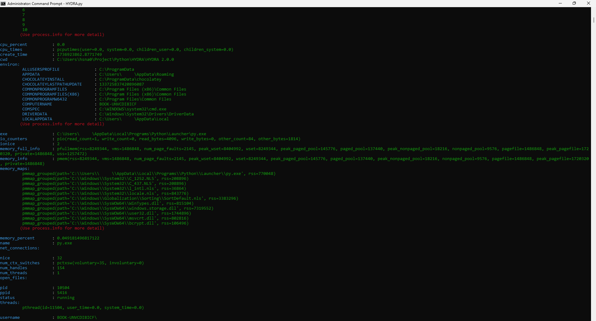
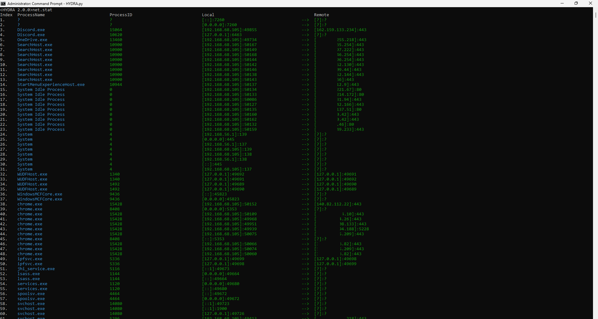

# HYDRA
Advanced Process &amp; Network Connection Management Utility

## Project Description
HYDRA is an **advanced process management utility, designed for monitoring and managing system processes and network connections** to detect malicious software.
HYDRA provides a comprehensive suite of tools for inspecting active processes, retrieving detailed information about them, and controlling their execution through termination or forced killing.
It also offers ***capabilities to track network activity, display real-time statistics on active connections, and identify external IP addresses with associated ISP details***.
The software is ***configurable with customizable settings, enabling users to adjust parameters for process information display and network monitoring***.
With a command-line interface, HYDRA empowers users to perform detailed inspections and take action against suspicious or resource-heavy activities, making it a valuable tool for system administrators and cybersecurity professionals.

## Pictures

## Versions
| Version          | Interface                        | Source Code                                                                                                                                                            |
|:-----------------|:---------------------------------|:-----------------------------------------------------------------------------------------------------------------------------------------------------------------------|
| 1.4.0            | Graphic User Interface (GUI)     | [https://github.com/mastermind65535/HYDRA/blob/main/HYDRA/HYDRA%201.4.0/HYDRA.py](https://github.com/mastermind65535/HYDRA/blob/main/HYDRA/HYDRA%201.4.0/HYDRA.py)     |
| 2.0.0            | Command Line Interface (CLI)     | [https://github.com/mastermind65535/HYDRA/blob/main/HYDRA/HYDRA%202.0.0/HYDRA.py](https://github.com/mastermind65535/HYDRA/blob/main/HYDRA/HYDRA%202.0.0/HYDRA.py)     |
| Alpha            | Command Line Interface (CLI)     | [https://github.com/mastermind65535/HYDRA/blob/main/HYDRA/HYDRA%201.4.0/HYDRA.py](https://github.com/mastermind65535/HYDRA/blob/main/HYDRA/HYDRA%201.4.0/HYDRA.py)     |
